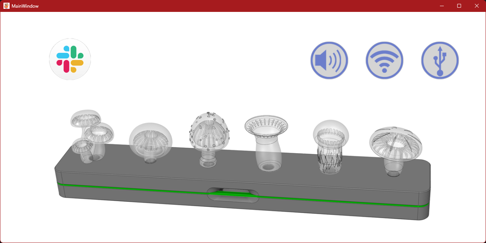
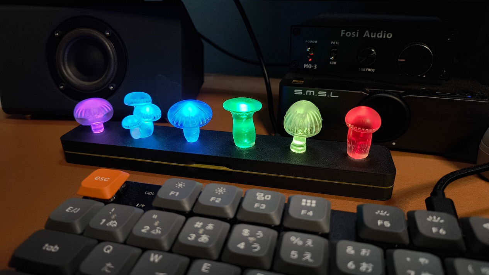

# SlappyHub
## About
**もう、Slackのメッセージを見落として、対応が遅れたり後で気まずくなることはありません**  
SlappyHubは、Slackのメッセージが届くとデスクトップガジェット(ハードウェア）SlappyBellと連動し、LEDの発光と音で通知するアプリケーションです。  
[SlappyBell ソースコード リポジトリ](https://github.com/yasuoki/SlappyBell)


SlappyHubアプリケーションのUI  
<br>  
---------------------
SlappyBell  
<br>  
---------------------

## Who is this for?
- Slackメッセージの着信を常時気にしていられない人
- 離席中でも重要な通知を確実に受け取りたい人
- デスクトップガジェットが好きな人

## Features
- **Slackメッセージの通知**  
Slackと連動し、メッセージの着信をLEDと音声で通知します。  
連携は、SlackのボットとしてSlackサービスに接続する形態のほか、Windowsの通知を監視して連携する2種類のモードがあります。

- **LED通知**  
通知するチャンネルやDMを6個のキノコに割り当て、メッセージの受信でキノコに仕込まれたフルカラーLEDをさまざまな発光パターンで発光させることができます。
LEDの発光は、Slackアプリで通知されたチャンネルを表示するまで継続するので、離席中の着信でも見落としません。
  
- **音声通知**  
6個のキノコに割り当てたチャンネルやDMに応じて、SlappyBellに内蔵するスピーカーから様々な着信音を鳴らすことができます。
もちろん音量の調整や一時的なミュートにも対応しています。

- **Wi-Fi接続**  
着信音は、SlappyBell本体にアップロードした mp3 ファイルを再生するのが基本動作です。  
また、SlappyBellのWi-Fi接続機能を利用して、http://～.mp3 のURLを指定し、ネット上の mp3 ファイルを再生することもできます。  

- **簡単な設定**  
Windowsの通知を監視するモードでは、Slack側の設定が不要なため簡単に利用できます。  
一方、Slackのボットとして接続するモードでは設定はやや手間ですが、より正確な通知が可能です。

## System Requirements
- SlappyBell デバイス
- Windows 11
- .NET 9.0
- Windows版 Slack デスクトップアプリケーション（ブラウザ版は非対応）

## Slack ボット連携
Slackのボットとして接続（Events API / Socket Mode）するためには、https://api.slack.com/apps/ からAppを作成し、接続トークンをSlappyHubに設定する必要があります。  
トークンはxapp-で始まるApp-Levelトークンと、xoxb-で始まるBot User OAuthトークンが必要になります。
トークン発行など詳細手順は、Slackの公式ページの説明を参照してください。  

App-Levelトークンは`connections:write`スコープを与えてください。

SlappyHubの動作には、OAuthトークンに次の権限が必要です。
```
app_mentions:read
channels:history
groups:history
im:history
mpim:history
channels:read
groups:read
mpim:read
reactions:read
users:read
```

また、通知したいチャンネルにSlappyHubボットを連携される必要があります。Slackアプリのチャンネル詳細から、インテグレーションにSlappyHubのAppを追加してください。

※ この設定は **Slackボット連携モードを使用する場合のみ必要** です。  
※ Slackはひとつのワークスペースに同時に接続するソケットモードコネクションを制限しています。多くの人が参加するワークスペースでは接続数の制約にかかる可能性があります。


